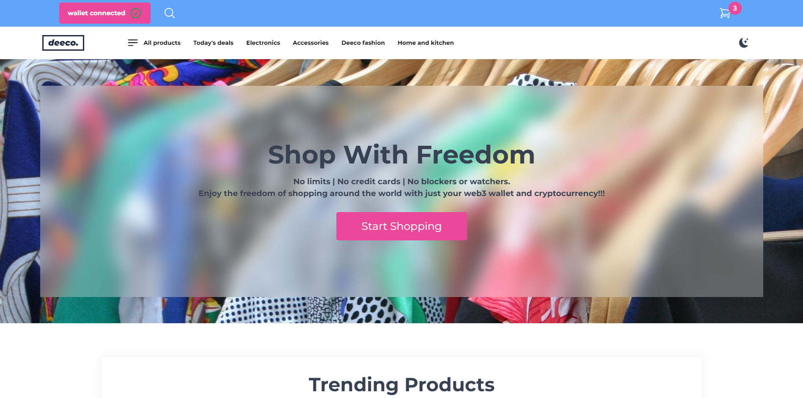
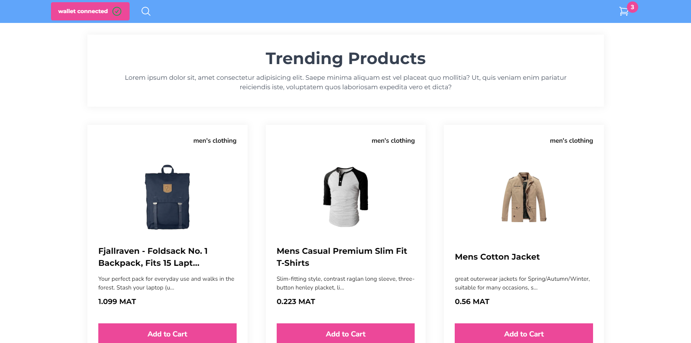
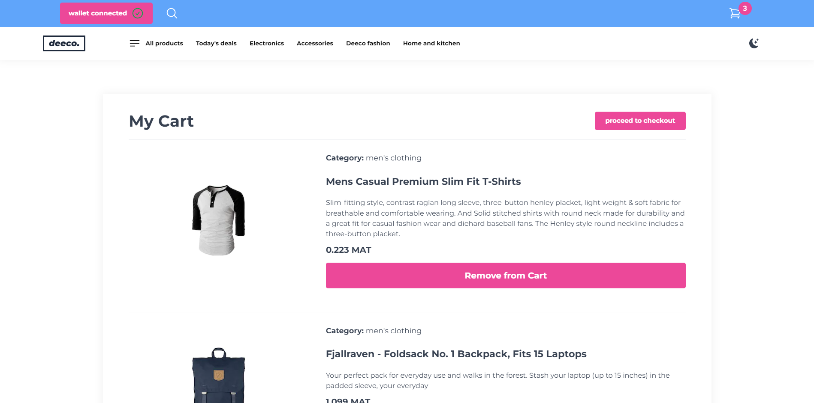
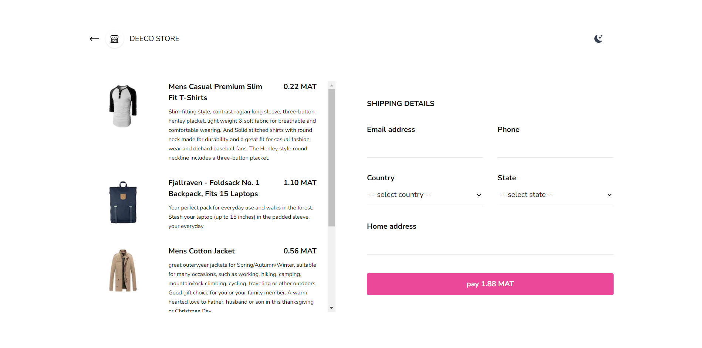
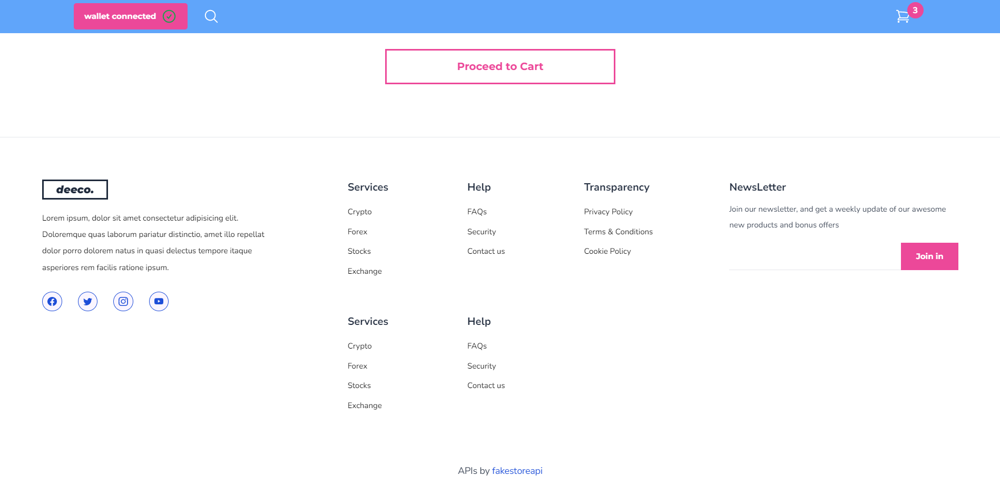

# deeco

"deeco" is an amazing web3 e-commerce Dapp, with crypto based payment - think an Ali express | Amazon | Ebay - web3/blockchain and crypto version. "deeco" is built as my submission for the hackathon phase of the Polygon Africa Bootcamp 2022.

"deeco is an amazing" e-commerce solution that will take advantage of the many benefits of blockchain technology and web3. It is an amazing app with payments to be powered directly by crypto tokens/coins.

"deeco" has a global scope - Thanks to the borderless power of cryptocurrency and the power of blockchain payments.

#### The project seeks to solve two(2) main problems.

1. The problem of limits - blockings and watchings: Limits set by financial institutions, can truly be advantageous, but these limits might sometimes be exploited to the disadvantage of the customers. Deeco is a project that removes all those blocking limits like credit card deposit and transfer limits. It provides the everyday e-commerce user with the power of so much freedom, transparency, and even security - if the smart contracts are well developed and audited.

2. The problem of public exclusion: Many folks out there, have probably only been hearing about cryptocurrency, blockchain and web3, but have never had a full experience or even a basic knowledge of the many awesome benefits of these innovations.
   My intentional entrance into the web3 and the blockchain world, left me wowed at the many awesome super powers of web3 and blockchain technology. Being able to build a platform like deeco where public interaction can be easily enhanced, to bring more public inclusion from regular people on the streets, is truly a pleasure.

## Build stack/technologies

> This repository consist of both the client/front-end and blockchain/smart contract aspects of the project.

Being a one man team in this hackathon made building deeco very challenging. It was an experience of a lifetime. "deeco" was built with so much 💝 by me, below is a list of the main awesome technologies that I used.

1. NextJs/ReactJs
2. TailwindCSS
3. React contect API
4. Google Firebase/Firestore
5. Solidity
6. Hardhat/Ethers
7. Husky
8. Prettier
9. Eslint
10. Commitlint
11. Mumbai(polygon) testnet.
12. Alchemy
13. Fake store API
14. Metamask

> The smart contract was deployed to the Mumbai(polygon) testnet with via alchemy.

> MATIC token/coin was used as the default currency for shopping on deeco.

> Please note, that the deeco project is fully and superbly responsive. It fits extremely well on different screen sizes.

## Live site

> The project is hosted live. You can explore it this link - https://deeco.vercel.app. Just take note to keep your metamask wallet handy.

## Live demo

> You can watch a live demo of the project here - https://live-demo - checkout the demo video to get wowed even further.

## Screenshots

Below are some awesome screenshots from deeco.












## Setting up for development

Below, are some basic setups to help you set up a local development environment for deeco.

### Client/Front-end

1. Open the project root directory with your code editor.

or use the command below.

```

cd deeco


```

2. Run the following command to enter into the "client" folder.

```

cd client


```

3. Run the following command to enter into the "blockchain" folder.

```

cd blockchain


```

4. Run the below command in both the "client" and "blockchain" folders to install all required dependencies.

```

pnpm install


```

5. When inside the "client" folder (after running the above install command), run the following command to start the app in development mode.

```

pnpm run dev


```

> Please take note that package management in this project is done using PNPM not NPM.

> You might need to do some more setups. If you ever get into any issues, just create a github issue, I'll respond as soon as possible. I'll also be a twitter DM or an email way.

- Twitter: https://twitter.com/AJ_Okpainmo

- Email: okpainmoandrew@gmail.com

- Phone: +234 81 8976 4364
